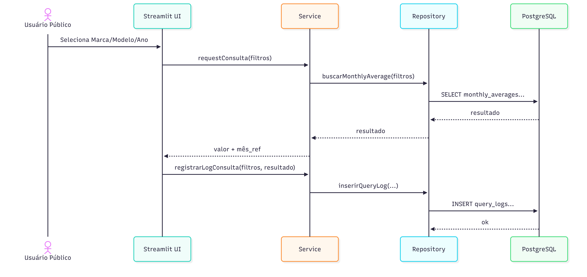
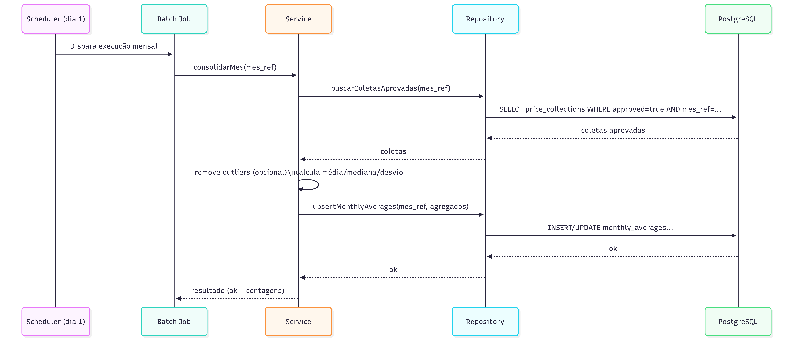

# Processos (BPMN)

Esta seção descreve o **processo de negócio completo** do CarFlow (visão end-to-end), incluindo papéis
que são **spec-only** (documentados, não implementados) e as partes **build** (Consulta pública + Batch).

---

## BPMN — Processo completo (visão macro)

[{ width="720" }](../assets/diagrams/bpmn-processo.png){ .glightbox }

### Objetivo do processo
Garantir coleta estruturada de preços, validação de qualidade e consolidação mensal para disponibilizar
consulta pública com desempenho e rastreabilidade.

---

## Participantes (lanes/pools sugeridos)
- **Coordenador (região)**
- **Pesquisador**
- **Sistema (CarFlow)**
- **Batch (Job mensal)**
- **Usuário Público**

> Admin/Gerente/Lojista podem aparecer como **subprocessos** ou **processos auxiliares** (spec-only),
mas o fluxo principal pode manter foco no ciclo semanal + ciclo mensal.

---

## Fluxo resumido (o que o diagrama representa)
1. **Planejamento semanal**: Coordenador define roteiro/lojas e atribui pesquisadores.
2. **Coleta em campo**: Pesquisador visita loja e registra coletas de veículos (marca, modelo, preço, ano-modelo, opcionais etc.).
3. **Validação**: Coordenador revisa e aprova/rejeita coletas.
4. **Consolidação mensal (Batch)**: no início do mês, o job consolida médias e grava em tabela otimizada para consulta.
5. **Consulta pública**: usuário consulta por Marca → Modelo → Ano-modelo e recebe valor consolidado e mês de referência.
6. **Log de consulta**: cada consulta gera registro em `query_logs` (sem dados pessoais).

---

## Regras importantes (para anotar no BPMN)
- Apenas **coletas aprovadas** entram no batch mensal.
- Consulta pública é **sem login**.
- Toda consulta gera log (sucesso/sem resultado/erro), sem dados pessoais.

---

## Diagramas complementares

### Swimlanes — visão por participante
[{ width="820" }](../assets/diagrams/swimlanes-processo.png){ .glightbox }

### Componentes — visão alto nível (camadas)
[{ width="320" }](../assets/diagrams/componentes-alto-nivel.png){ .glightbox }

### Sequência — consulta pública
[{ width="820" }](../assets/diagrams/sequencia-consulta-publica.png){ .glightbox }

### Sequência — batch mensal
[{ width="820" }](../assets/diagrams/sequencia-batch-mensal.png){ .glightbox }

---

