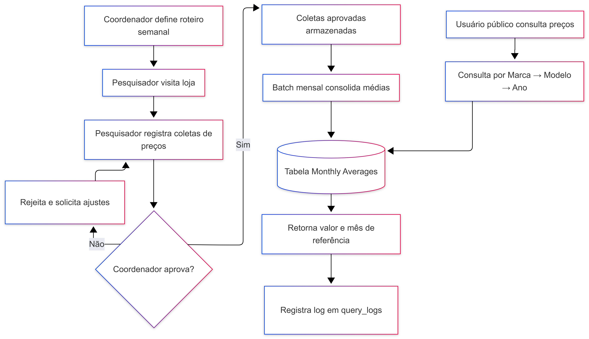

# Processos (BPMN)

Esta seção descreve o **processo de negócio completo** do CarFlow (visão end-to-end), mapeando o ciclo de vida da informação desde o planejamento da visita até a consolidação do preço médio.

O escopo inclui papéis **spec-only** (documentados para contexto) e as partes **build** (Consulta pública + Batch).

---

## 1. Macrofluxo do Processo (BPMN)

O diagrama abaixo apresenta o fluxo lógico das atividades, decisões e responsabilidades.

[{ width="800" }](../assets/diagrams/bpmn-processo.png){ .glightbox }

### Objetivo do Processo
Garantir uma coleta estruturada de preços em campo, submetida a uma validação de qualidade rigorosa, resultando em uma base consolidada mensalmente para consulta pública rápida e auditável.

---

## 2. Atores e Responsabilidades

| Ator | Tipo | Responsabilidade no Processo |
| :--- | :--- | :--- |
| **Coordenador** | Humano | Planejamento semanal (roteiros) e Controle de Qualidade (aprovação). |
| **Pesquisador** | Humano | Execução da coleta em campo (Input de dados). |
| **Sistema (Batch)** | Sistêmico | Consolidação massiva de dados (ETL) no dia 1º do mês. |
| **Usuário Público** | Humano | Consumo da informação final (Consulta). |

> *Nota:* Papéis administrativos (Admin/Gerente) e de Parceiros (Lojista) são considerados processos de apoio e não estão detalhados neste fluxo principal.

---

## 3. Descrição do Fluxo

### 3.1. Ciclo Semanal (Operacional)
1.  **Planejamento:** O Coordenador define quais lojas devem ser visitadas e atribui a tarefa ao Pesquisador.
2.  **Coleta:** O Pesquisador vai à loja e registra os veículos.
3.  **Validação:** O Coordenador analisa as coletas pendentes:
    * **Se Aprovado:** O dado fica pronto para o processamento mensal.
    * **Se Rejeitado:** O dado volta para correção ou descarte.

### 3.2. Ciclo Mensal (Sistêmico)
1.  **Consolidação:** No fechamento do mês, o Job (Batch) processa apenas os registros aprovados.
2.  **Cálculo:** Gera-se a média, mediana e desvio padrão por modelo.
3.  **Publicação:** Os dados são gravados na tabela de leitura rápida (`monthly_averages`).

### 3.3. Ciclo Sob Demanda (Consulta)
1.  **Acesso:** O Usuário Público acessa a interface web.
2.  **Filtro:** Seleciona Marca → Modelo → Ano.
3.  **Resultado:** O sistema exibe o preço consolidado e registra o log da operação.

---

## 4. Regras de Negócio do Processo

* **RN01 - Qualidade do Dado:** Apenas coletas com status `APPROVED` entram no cálculo da média mensal.
* **RN02 - Acesso Livre:** A consulta pública não exige autenticação (login).
* **RN03 - Rastreabilidade:** Toda consulta pública deve gerar um registro de auditoria técnica (Log), independente se houve resultado ou erro.

---

## Diagramas complementares

### Swimlanes — visão por participante
[{ width="820" }](../assets/diagrams/swimlanes-processo.png){ .glightbox }

> **Para detalhes de implementação técnica:**
>
> A modelagem das classes, diagramas de sequência (interação entre objetos) e arquitetura de componentes estão detalhados na seção **[Technical Design](../06-technical-design/index.md)**.