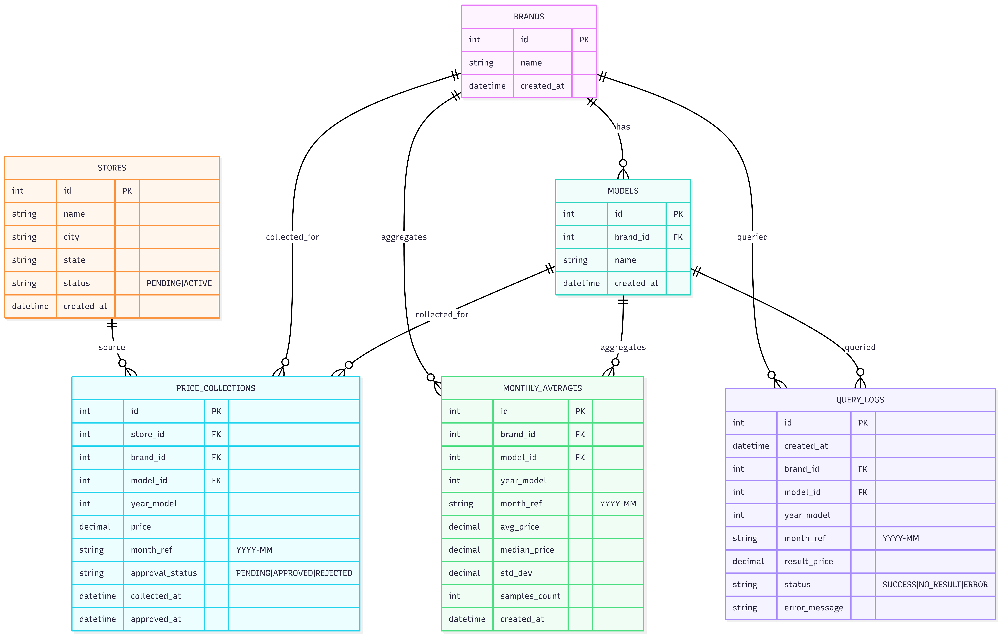
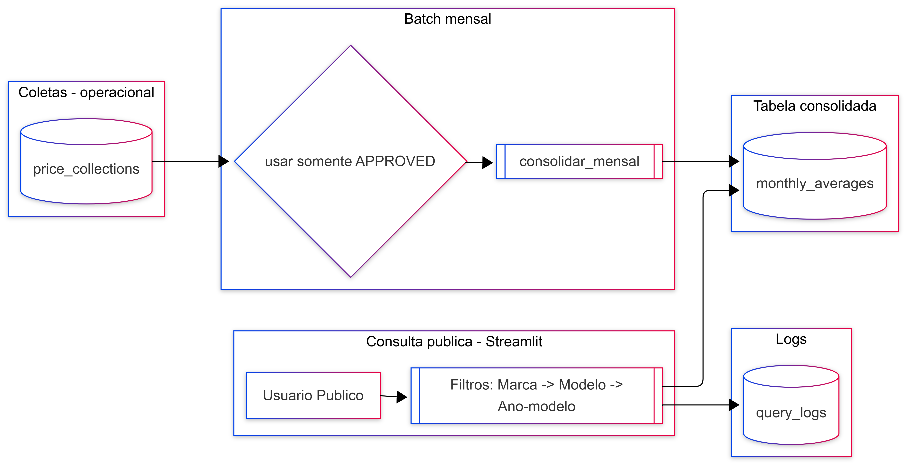

# Modelagem de Dados (ERD)

Esta seção descreve o **modelo de dados** do CarFlow, com foco no escopo **build**:
- **Consulta pública (sem login)** para preço consolidado
- **Batch mensal** de consolidação de médias
- **Registro de logs** das consultas (sem dados pessoais)

A visão completa do processo (papéis operacionais como pesquisador/coordenador etc.) é documentada,
porém **não será implementada** nesta versão.

---

## ERD — Visão geral

[{ width="720" }](../assets/diagrams/erd-01-visao-geral.png){ .glightbox }

---

## Entidades (descrição rápida)

### `brands`
Catálogo de **marcas** (ex.: Toyota, Fiat).

### `models`
Catálogo de **modelos**, sempre associado a uma marca.
Ex.: Corolla (Toyota), Uno (Fiat).

### `stores`
Cadastro de **lojas** (origem das coletas).  
Nesta versão, é usado para simular a origem dos preços (seed).

### `price_collections`
Tabela de **coletas brutas** (preços capturados em lojas).  
Representa o dado “operacional” que alimenta a consolidação mensal.

### `monthly_averages`
Tabela **consolidada** (otimizada para leitura), usada pela **consulta pública**.  
Cada linha representa o preço consolidado do mês para (marca, modelo, ano-modelo).

### `query_logs`
Registro de logs da **consulta pública** para análise de uso/diagnóstico.  
Não armazena dados pessoais.

---

## Relacionamentos e cardinalidade (interpretação)

- Uma `brand` possui vários `models` (**1:N**)
- Uma `store` origina várias `price_collections` (**1:N**)
- Um `model` pode ter várias `price_collections` ao longo do tempo (**1:N**)
- Um `model` pode ter várias `monthly_averages` (por mês/ano-modelo) (**1:N**)
- Um `model` pode aparecer em vários `query_logs` (**1:N**)

---

## Integridade referencial (FKs)

- `models.brand_id` → `brands.id`
- `price_collections.store_id` → `stores.id`
- `price_collections.brand_id` → `brands.id`
- `price_collections.model_id` → `models.id`
- `monthly_averages.brand_id` → `brands.id`
- `monthly_averages.model_id` → `models.id`
- `query_logs.brand_id` → `brands.id` (nullable)
- `query_logs.model_id` → `models.id` (nullable)

## Regras de negócio refletidas no modelo

### Aprovação de coletas
- Apenas registros de `price_collections` com `approval_status = APPROVED` podem ser utilizados no batch.

### Consulta pública
- A consulta pública lê apenas `monthly_averages` (não acessa `price_collections` diretamente).
- Toda consulta registra um evento em `query_logs`, mesmo quando não encontra resultado.

### Referência temporal (mês)
- O campo `month_ref` usa o formato `YYYY-MM` (ex.: `2026-02`).

---

## Restrições e índices (versão 1)

### UNIQUE (integridade)
- `brands.name`
- `models (brand_id, name)`
- `monthly_averages (brand_id, model_id, year_model, month_ref)`

> Observação: o `year_model` faz parte da chave lógica de consulta, pois o usuário filtra por ano-modelo.

### Índices (perfomance)
- `monthly_averages (brand_id, model_id, year_model, month_ref)` — caminho principal da consulta pública
- `price_collections (approval_status, month_ref)` — caminho principal do batch mensal
- `query_logs (created_at)` — consultas por período e auditoria técnica

### CHECK constraints (domínios)

- `stores.status` ∈ {`PENDING`, `ACTIVE`}
- `price_collections.approval_status` ∈ {`PENDING`, `APPROVED`, `REJECTED`}
- `query_logs.status` ∈ {`SUCCESS`, `NO_RESULT`, `ERROR`}
- `month_ref` no formato `YYYY-MM` (validação por aplicação e/ou constraint futuramente)

---

## Decisão de modelagem (denormalização controlada)

Algumas tabelas armazenam `brand_id` junto com `model_id` para simplificar filtros e reduzir joins
na consulta pública e no batch.  
A consistência “modelo pertence à marca” é garantida pela camada de serviço/batch.
Em uma evolução futura, essa regra pode ser reforçada no banco (ex.: VIEW/trigger).

### Fluxo de dados (consulta + batch)

[{ width="720" }](../assets/diagrams/dataflow-01-consulta-batch.png){ .glightbox }

> A figura mostra a origem dos dados (`price_collections`), a consolidação mensal no batch (somente `APPROVED`),
> a tabela consolidada (`monthly_averages`) e o registro de auditoria de consultas (`query_logs`).

---

## Dicionário de Dados (versão 1)

### `brands`
| Campo | Tipo | Obrigatório | Regras / Observações |
|------|------|-------------|----------------------|
| id | int | sim | PK |
| name | string | sim | UNIQUE |
| created_at | datetime | sim | timestamp de criação |

### `models`
| Campo | Tipo | Obrigatório | Regras / Observações |
|------|------|-------------|----------------------|
| id | int | sim | PK |
| brand_id | int | sim | FK → `brands.id` |
| name | string | sim | UNIQUE por marca (`brand_id`, `name`) |
| created_at | datetime | sim | timestamp de criação |

### `stores`
| Campo | Tipo | Obrigatório | Regras / Observações |
|------|------|-------------|----------------------|
| id | int | sim | PK |
| name | string | sim | nome da loja |
| city | string | sim | cidade |
| state | string | sim | UF |
| status | string | sim | `PENDING` ou `ACTIVE` |
| created_at | datetime | sim | timestamp de criação |

### `price_collections`
| Campo | Tipo | Obrigatório | Regras / Observações |
|------|------|-------------|----------------------|
| id | int | sim | PK |
| store_id | int | sim | FK → `stores.id` |
| brand_id | int | sim | FK → `brands.id` |
| model_id | int | sim | FK → `models.id` |
| year_model | int | sim | ano-modelo do veículo |
| price | decimal | sim | preço coletado |
| month_ref | string | sim | `YYYY-MM` |
| approval_status | string | sim | `PENDING`, `APPROVED` ou `REJECTED` |
| collected_at | datetime | sim | data/hora de coleta |
| approved_at | datetime | não | preenchido quando aprovado |

### `monthly_averages`
| Campo | Tipo | Obrigatório | Regras / Observações |
|------|------|-------------|----------------------|
| id | int | sim | PK |
| brand_id | int | sim | FK → `brands.id` |
| model_id | int | sim | FK → `models.id` |
| year_model | int | sim | ano-modelo |
| month_ref | string | sim | `YYYY-MM` |
| avg_price | decimal | sim | média consolidada |
| median_price | decimal | não | opcional (qualidade) |
| std_dev | decimal | não | opcional (qualidade) |
| samples_count | int | sim | quantidade de amostras consideradas |
| created_at | datetime | sim | timestamp de criação |

### `query_logs`
| Campo | Tipo | Obrigatório | Regras / Observações |
|------|------|-------------|----------------------|
| id | int | sim | PK |
| created_at | datetime | sim | timestamp do evento |
| brand_id | int | não | filtro usado (se houver) |
| model_id | int | não | filtro usado (se houver) |
| year_model | int | não | filtro usado (se houver) |
| month_ref | string | não | `YYYY-MM` quando aplicável |
| result_price | decimal | não | preenchido quando `SUCCESS` |
| status | string | sim | `SUCCESS`, `NO_RESULT` ou `ERROR` |
| error_message | string | não | apenas se `ERROR` |

---

## Limites e próximos passos

**Fora do escopo (build)** nesta versão:
- CRUD de usuários e papéis operacionais (Admin/Gerente/Coordenador/Pesquisador/Lojista)
- fluxo de aprovação real em UI (será simulado via seed/status)

**Próximo artefato ligado ao modelo:**
- “Arquitetura (C4)” mostrando onde o modelo vive (SQLAlchemy + Postgres) e os fluxos:
  - Consulta pública → `monthly_averages` + `query_logs`
  - Batch mensal → `price_collections` → `monthly_averages`
