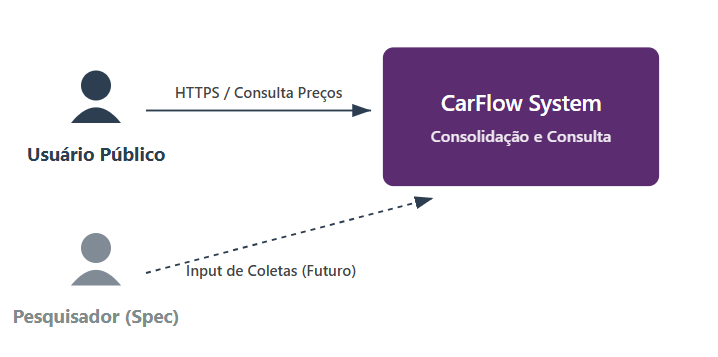
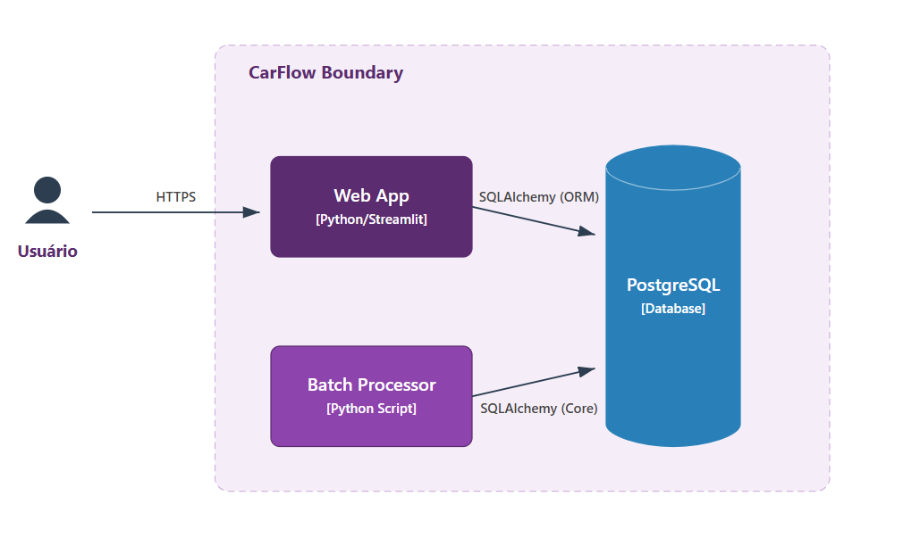
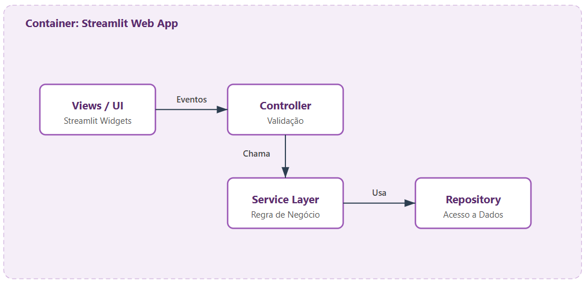

# Arquitetura do Sistema (C4 Model)

Esta seção descreve a arquitetura do **CarFlow** utilizando o modelo **C4 (Context, Containers, Components)**. A documentação parte do nível macro (Contexto) até o nível de organização de código (Componentes), detalhando fronteiras, tecnologias e responsabilidades.

---

## 1. Nível 1: Diagrama de Contexto
**Objetivo:** Apresentar o sistema como uma "caixa preta" e suas interações com os usuários.

[{ width="600" }](../assets/diagrams/C4-Contexto.png){ .glightbox }

### Atores e Sistemas
* **Usuário Público:** Ator principal do escopo *Build*. Acessa o sistema via navegador para consultar preços consolidados. Não requer autenticação.
* **CarFlow System:** O sistema em si. Responsável pela consolidação (Batch), armazenamento e exibição dos dados de mercado.
* **Equipe Operacional (Spec-only):** Representa os perfis (Pesquisador, Coordenador) que alimentam a base. Nesta versão, suas interações são documentadas para contexto, mas não implementadas no MVP.

---

## 2. Nível 2: Diagrama de Container
**Objetivo:** Abrir a "caixa preta" e mostrar as unidades de deploy (containers Docker) e tecnologias escolhidas.

[{ width="620" }](../assets/diagrams/C4-Container.png){ .glightbox }

### Decisões de Arquitetura
1.  **Monólito Modular (Web App):** Optou-se pelo **Streamlit** como container único de aplicação. Ele atua simultaneamente como *Frontend* (UI) e *Backend* (Controller), simplificando a infraestrutura inicial sem perder capacidade de processamento.
2.  **Segregação de Processamento (Batch):** O cálculo de médias (pesado) foi isolado em um container/processo **Batch** separado.
    * *Justificativa:* Evitar que o processamento massivo de dados trave a navegação do usuário na interface web.
3.  **Persistência Relacional (PostgreSQL):** Escolhido pela robustez na integridade referencial (essencial para relacionar Marcas, Modelos e Coletas) e suporte a JSONB para logs.

---

## 3. Nível 3: Diagrama de Componentes
**Objetivo:** Detalhar a organização interna do Container "Web App" para orientar o desenvolvimento.

[{ width="650" }](../assets/diagrams/C4-Componentes.png){ .glightbox }

### Estrutura de Camadas
Para evitar o acoplamento excessivo, o código do Streamlit foi estruturado em camadas lógicas:

* **Views (UI):** Camada puramente visual. Renderiza widgets e captura eventos. **Não contém regras de negócio.**
* **Controller:** Orquestra a requisição. Valida inputs e chama o Serviço adequado.
* **Service Layer:** O coração da regra de negócio. Contém a lógica de domínio pura. Desconhece o Streamlit e o SQL.
* **Repository Layer:** Abstrai o acesso a dados. Garante que o domínio não dependa de SQL direto.