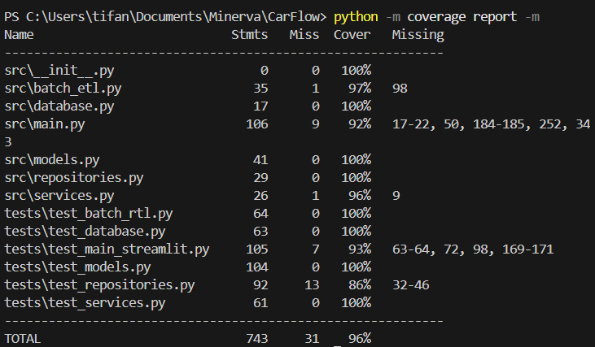

# Estratégia de Qualidade (QA)

A garantia de qualidade do CarFlow baseia-se em três pilares: Análise Estática, Testes Automatizados com alta cobertura e Integração Contínua (CI). O objetivo é garantir que as regras de negócio e o processamento de dados (ETL) permaneçam estáveis a cada evolução.

---

## 1. Ferramentas Utilizadas

| Ferramenta | Tipo | Função |
| :--- | :--- | :--- |
| **Ruff** | Linter / Formatter | Analisa o código estaticamente em busca de erros de sintaxe e violações de estilo (PEP 8). |
| **Pytest** | Framework de Teste | Execução de testes unitários e de integração. |
| **Coverage.py** | Análise de Cobertura | Mede qual porcentagem do código fonte foi executada durante os testes. |
| **GitHub Actions** | CI Server | Orquestrador que executa o pipeline a cada Push ou Pull Request. |

---

## 2. Pipeline de Integração Contínua (CI)

O fluxo de CI está definido no arquivo `.github/workflows/ci.yml`.

### Estágios do Pipeline:
1.  **Trigger:** Acionado em qualquer `push` ou `pull_request` para a `main`.
2.  **Setup:** Provisiona uma máquina virtual Ubuntu e instala Python 3.11.
3.  **Dependências:** Instala as bibliotecas do `requirements.txt`.
4.  **Linting (Gatekeeper):** Executa o `ruff check .`. Se houver código fora do padrão, o pipeline falha.
5.  **Testes & Cobertura:** Executa o `pytest` validando a lógica e garantindo a integridade dos dados.

[{ width="600" }](../assets/images/teste3.png){ .glightbox }

---

## 3. Métricas de Cobertura (Code Coverage)

O projeto mantém um padrão rigoroso de qualidade, atingindo atualmente **96% de cobertura de código**.

Isso significa que quase a totalidade das linhas de código lógicas (Services, ETL, Repositories e Utils) são validadas a cada deploy.

Foi monitorado cobertura de código para garantir que caminhos críticos não fiquem desprotegidos.

| Componente | Meta de Cobertura | Crítico? |
| :--- | :--- | :--- |
| **Services (Lógica)** | > 90% | Sim |
| **Repositories (SQL)** | > 80% | Sim |
| **Models (ORM)** | > 95% | Não (declarativo) |
| **UI (Streamlit)** | > 50% | Não (Smoke test) |

[{ width="600" }](../assets/images/teste1.png){ .glightbox }
[{ width="600" }](../assets/images/teste2.png){ .glightbox }
---

## 4. Cenários de Teste Principais

A suíte de testes automatizados foca nas áreas críticas do sistema:

1.  **Cálculo de Médias (ETL):**
    * Verificar se o agrupamento de preços ignora corretamente dados nulos.
    * Garantir que a média ponderada considera os volumes corretos.
2.  **Resiliência de Dados:**
    * **Idempotência:** Rodar o Batch duas vezes seguidas não deve duplicar registros na tabela `monthly_averages`.
3.  **Conectividade e Falhas:**
    * Simular queda de banco de dados (Mock) para garantir que o sistema exibe mensagens de erro amigáveis em vez de travar (Crash).