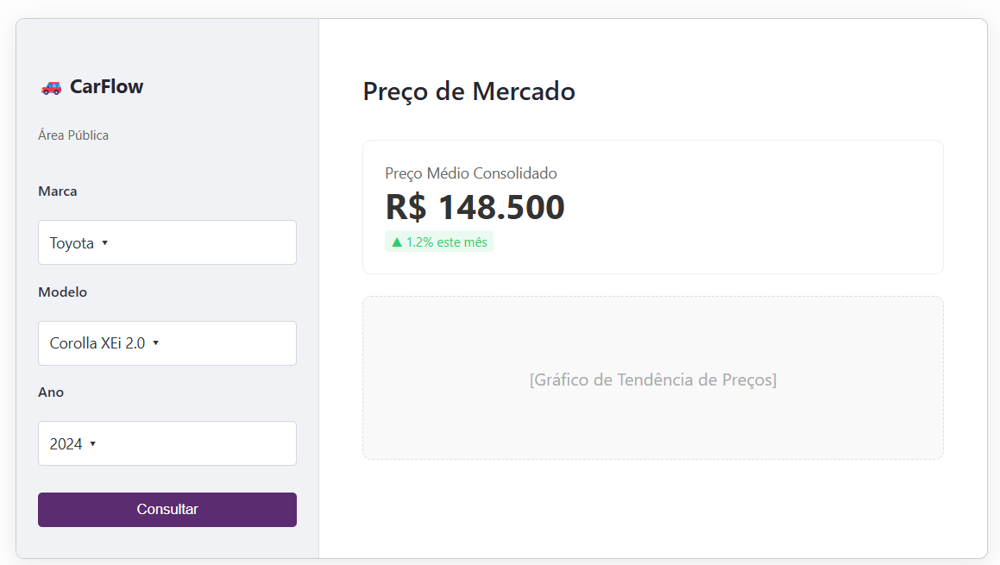
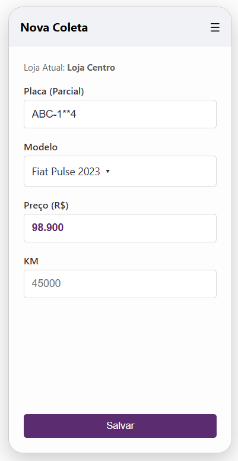
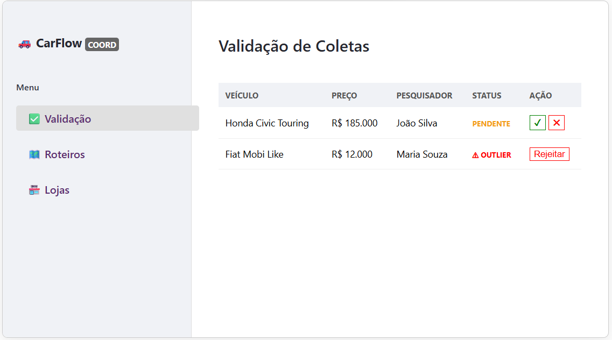
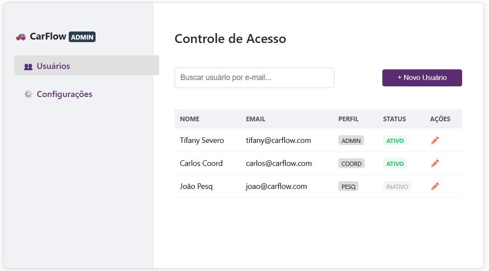

# Protótipos de Interface (UI/UX)

Esta seção apresenta os **wireframes de alta fidelidade** para todos os atores identificados nos requisitos. O objetivo é validar a usabilidade e garantir que cada papel tenha sua interface definida.

O projeto adota uma estratégia de **Interface Unificada (Streamlit)**: todas as telas são web, acessíveis via navegador, com layouts responsivos adaptados à função.

---

## 1. Módulo Público (Acesso Livre)

### 1.1. Consulta de Preços (Usuário Público)

**Status:** Build (Implementado)
A interface principal do produto. Design "buscou, achou", focada na entrega rápida do valor consolidado.

- **Filtros:** Marca → Modelo → Ano (Cascata).
- **Visualização:** KPIs de preço e gráfico de tendência histórica.

[{ width="720" }](../assets/telas/usuario.png){ .glightbox }

### 1.2. Cadastro de Parceiro (Lojista)
**Status:** Spec-only
Tela de "Landing Page" onde um lojista pode solicitar seu credenciamento para receber visitas.

- **Funcionalidade:** Formulário de auto-cadastro (Nome da Loja, CNPJ, Endereço).
- **Fluxo:** Ao enviar, gera uma pendência para aprovação do Coordenador Regional.

[{ width="520" }](../assets/telas/lojista.png){ .glightbox }

---

## 2. Módulo Operacional (Campo & Tático)

### 2.1. Coleta Mobile (Pesquisador)
**Status:** Spec-only
Interface web responsiva (formato smartphone) para digitação ágil dentro das lojas.

- **UX:** Campos grandes, input numérico otimizado e upload opcional de fotos.

[{ width="320" }](../assets/telas/pesquisador.png){ .glightbox }

### 2.2. Gestão Regional (Coordenador)
**Status:** Spec-only
Dashboard para controle de qualidade e gestão da equipe local.

- **Validação:** Tabela para aprovar/rejeitar coletas (destaque para outliers).
- **Roteiros:** (Futuro) Interface para definir quais lojas os pesquisadores visitarão.

[{ width="700" }](../assets/telas/coordenador.png){ .glightbox }

---

## 3. Módulo Administrativo (Backoffice)

### 3.1. Gestão de Catálogo (Gerente)
**Status:** Spec-only
Responsável pela padronização dos dados. É aqui que se evita duplicidade (ex: "Fiat" vs "FIAT").

- **Ação:** Cadastro de novas Marcas e Modelos que aparecerão na busca pública.

[{ width="700" }](../assets/telas/gerente.png){ .glightbox }

### 3.2. Controle de Acesso (Administrador)
**Status:** Spec-only
Interface técnica para gestão de usuários do sistema.

- **Ação:** Criar contas para Gerentes, Coordenadores e Pesquisadores, definindo seus perfis (RBAC).

[{ width="700" }](../assets/telas/admin.png){ .glightbox }

---

